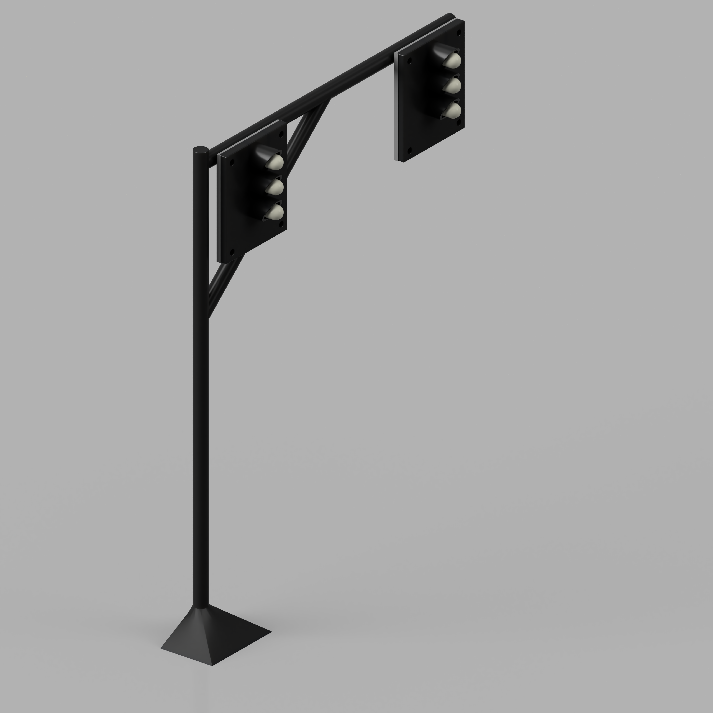

# **Traffic Control System** 🚦  

## Table of Contents
- [**Traffic Control System** 🚦](#traffic-control-system-)
  - [Table of Contents](#table-of-contents)
  - [Workflow Status](#workflow-status)
  - [Introduction \& Background](#introduction--background)
    - [Background](#background)
    - [Rationale](#rationale)
    - [Scope](#scope)
  - [Design Specifications](#design-specifications)
    - [Hand Drawn Schematic of the Physical Design](#hand-drawn-schematic-of-the-physical-design)
    - [Microservice Architecture Design Diagram](#microservice-architecture-design-diagram)
    - [Early Design Mockup](#early-design-mockup)
    - [Final Design Implementation](#final-design-implementation)
      - [User Login](#user-login)
      - [Available Signals](#available-signals)
      - [Incident Reports for a Traffic Light](#incident-reports-for-a-traffic-light)
      - [Live Traffic Light](#live-traffic-light)
      - [Accounts Page](#accounts-page)
    - [Physical Design Components](#physical-design-components)
      - [PCB Design Image](#pcb-design-image)
      - [Design Assembly Render](#design-assembly-render)
      - [Design Assembly Render Video](#design-assembly-render-video)
      - [Physical Design Photo](#physical-design-photo)
  - [Installing the Microservices](#installing-the-microservices)
  - [Client Install Instructions:](#client-install-instructions)
    - [Client Debugging](#client-debugging)

## Workflow Status

| Workflow | Status |
|----------|--------|
| CI MVC Application | [](https://github.com/NinePiece2/Traffic-Control-System/actions/workflows/build-mvc.yml)|
| CI API Application | [](https://github.com/NinePiece2/Traffic-Control-System/actions/workflows/build-api.yml) |
| CI Video Application | [](https://github.com/NinePiece2/Traffic-Control-System/actions/workflows/build-video.yml) |
| CD MVC, API, and Video Applications | [](https://github.com/NinePiece2/Traffic-Control-System/actions/workflows/deploy.yml) |
| Client CI Pipeline | [](https://github.com/NinePiece2/Traffic-Control-System/actions/workflows/python-docker.yml) |

## Introduction & Background

A **smart traffic control system** designed to efficiently manage and optimize traffic flow.

### Background
In the modern day, successfully controlling urban traffic in the city is a necessity due to the ever-increasing number of vehicles and, consequently, the need for pedestrian safety.  In considering the traffic control system, what comes to mind is its ability to handle complex, changing traffic conditions, communicate clearly, and be accessible to visually impaired pedestrians. Additionally, incorporating sophisticated monitoring and control features into these systems continues to pose a technical challenge.

A frequent drawback in previous designs was the dependence on RF-link communication, which imposed limitations regarding data transmission reliability and scalability. To overcome these limitations, this project shifts to utilizing WiFi communication, providing increased flexibility, greater bandwidth, and improved compatibility with contemporary web-oriented control systems.

### Rationale
When determining the core processing unit, the Raspberry Pi was selected with the vision of being capable of employing adaptable and affordable embedded systems. Some of the benefits of the Raspberry Pi include real-time data processing, streamlined integration with cameras and sensors, and effective communication through WiFi. This makes it a perfect option for projects that need both hardware management and software interaction.

The web technologies were chosen to offer an intuitive user interface for system supervision and management. A .NET MVC website was created, incorporating Microsoft Identity Framework for secure user login, allowing the traffic system managers to have remote access to the system. As a result, supervisors can easily change parameters, manually control traffic signals, and view stored camera data such as images and videos of traffic violations. The addition of video imaging features improves the dependability of the system by allowing for future footage examination, holding violators accountable.

### Scope
The prototype created in this project tackles essential elements of traffic management by emphasizing real-time regulation and accessibility components. The system comprises:

1.	Real-Time Traffic Management: Combining magnetic reed switches and pedestrian buttons enables adaptive modification of traffic signals according to the presence of vehicles and pedestrians.
2.	Pedestrian Support: Buttons to signal a pedestrian to cross safely. Additionally, chimes at the time of safe crossing to signal the visually impaired are included.
3.	Traffic Violation Surveillance: A CMOS camera records high-quality images of traffic infractions, with video recording capabilities available for immediate processing and storage.
4.	Remote Management: A prototype website, developed using .NET MVC, allows for secure manual traffic light operations and remote observation of violation information.

This project provides a scalable solution for traffic control issues by incorporating contemporary technologies and enhancing traditional models. Future versions can upgrade the system’s capabilities to incorporate sophisticated image recognition, cloud storage, and overall traffic management across the network.

---

## Design Specifications

The Traffic Light Control System is designed to improve traffic management and pedestrian safety while addressing modern urban mobility challenges. The system provides:
-	Accessibility for Visually Impaired Pedestrians: Auditory signals inform visually impaired individuals when it is safe to cross the street.
-	Traffic Violation Detection: The Traffic Light Control System uses pressure sensors in order to detect when a vehicle crosses an intersection under a red light. It also uses a camera to take a picture of the violator's license plate, and record it for further use.
-	Remote Control and Data Access: The system uses a user friendly GUI, which, when connected to the internet, allows for monitoring the intersection at real time. Other features include recording and storing violations, and also manually adjusting the lights using an override.
-	Operation Modes: The user can change  traffic signal timings in accordance to different times of the day. this is useful for when there is an unexpected scenario, or an increase or decrease in traffic.
-	Power and Processing Requirements: A 5V power supply supports a Raspberry Pi single-board computer. The Raspberry Pi's integrated GPIO pins are used to interface with sensors, cameras, and traffic signal components, making it a very easy to use platform for this application.

### Hand Drawn Schematic of the Physical Design

[](images/HandDrawnSchematic.png)

### Microservice Architecture Design Diagram

[](images/CapstoneConnections(Dark).png)

### Early Design Mockup

[](images/HandDrawnMockup1.png)
[](images/HandDrawnMockup2.png)

### Final Design Implementation

#### User Login 

[](images/FinalDesignLogin.png)

#### Available Signals

[](images/FinalDesignAvailableSignals.png)

#### Incident Reports for a Traffic Light

[](images/FinalDesignIncidentReports.png)

#### Live Traffic Light

[](images/FinalDesignLiveTrafficLight.png)

#### Accounts Page

[](images/FinalDesignAccountsPage.png)

### Physical Design Components

To make the physical design look cohesive, a custom Printed Circut Board was designed and manufactured to replicate an actual traffic light. The CAD and PCB design files are availabe <a href="https://github.com/NinePiece2/Traffic-Control-System/tree/master/CADFiles" target="_blank" rel="noopener noreferrer">here</a>. The CAD files were designed using Fusion 360 and the PCB was created using KiCAD.

#### PCB Design Image

[](images/PCBDesign.png)

#### Design Assembly Render

[](images/Dual_Traffic_Light_Variant_2_Assembly_Render_Front.png)

#### Design Assembly Render Video

<!-- <video src="images/Dual_Traffic_Light_Variant_2_Assembly_Render_v3_Animation_2.mp4" autoplay muted loop playsinline width="800"></video> -->

Click to Watch:

<a href="images/Dual_Traffic_Light_Variant_2_Assembly_Render_v3_Animation_2.mp4">
  
</a>


#### Physical Design Photo

[](images/PhysicalDesignImplementaion.jpg)

---

## Installing the Microservices

Use ```docker-compose.yml``` and change the variables where applicable to allow the microservices to communicate with each other. Use SSL certificates as required. The `JWT_KEY` should be the same on all the services.

```docker-compose.yml```:

```yml
version: '3.8'

services:
  mvc:
    image: ninepiece2/traffic-control-system:mvc
    container_name: Traffic-Control-System
    ports:
      - "8443:8443"
    volumes:
      - /root/certs:/https:ro
    environment:
      - ASPNETCORE_URLS=https://*:8443;http://*:8080
      - ASPNETCORE_Kestrel__Certificates__Default__Path=/https/ssl.crt
      - ASPNETCORE_Kestrel__Certificates__Default__KeyPath=/https/ssl.key
      - ASPNETCORE_ENVIRONMENT=${ASPNETCORE_ENVIRONMENT}
      - SyncfusionLicense=${SyncfusionLicense}
      - BaseUrl=https://trafficcontrolsystem.romitsagu.com
      - VideoServiceURL=https://stream-trafficcontrolsystem.romitsagu.com
      - StreamServiceURL=https://stream1-trafficcontrolsystem.romitsagu.com
      - APIURL=https://api-trafficcontrolsystem.romitsagu.com
      - API_KEY=${JWT_Key}
    command: ["dotnet", "Traffic-Control-System.dll"]
    restart: always
  
  api:
    image: ninepiece2/traffic-control-system:api
    container_name: Traffic-Control-System-API
    ports:
      - "8445:8445"
    volumes:
      - /root/certs:/https:ro
    environment:
      - ASPNETCORE_URLS=https://*:8445;http://*:8080
      - ASPNETCORE_Kestrel__Certificates__Default__Path=/https/ssl.crt
      - ASPNETCORE_Kestrel__Certificates__Default__KeyPath=/https/ssl.key
      - ASPNETCORE_ENVIRONMENT=${ASPNETCORE_ENVIRONMENT}
      - StreamServiceURL=https://stream1-trafficcontrolsystem.romitsagu.com
      - JWT:Issuer=https://api-trafficcontrolsystem.romitsagu.com
      - JWT:Audience=https://api-trafficcontrolsystem.romitsagu.com
      - JWT:Key=${JWT_Key}
    command: ["dotnet", "Traffic-Control-System-API.dll"]
    restart: always

  video:
    image: ninepiece2/traffic-control-system:video
    container_name: Traffic-Control-System-Video
    ports:
      - "1935:1935"
      - "8446:8446"
    volumes:
      - /root/certs:/https:ro
    environment:
      - ASPNETCORE_URLS=https://*:8446;http://*:8080
      - ASPNETCORE_Kestrel__Certificates__Default__Path=/https/ssl.crt
      - ASPNETCORE_Kestrel__Certificates__Default__KeyPath=/https/ssl.key
      - ASPNETCORE_ENVIRONMENT=${ASPNETCORE_ENVIRONMENT}
      - JWT:Issuer=https://stream-trafficcontrolsystem.romitsagu.com
      - JWT:Audience=https://stream-trafficcontrolsystem.romitsagu.com
      - JWT:Key=${JWT_Key}
    command: ["dotnet", "Traffic-Control-System-Video.dll"]
    restart: always
```

## Client Install Instructions:

Run the following on a Raspberry Pi 5. This will install docker, docker compose and create a new folder with the ```docker-compose.yml``` file and a config file located under ```config/config.json```. After creating a new traffic light in the MVC application enter the outputed config values in the ```config/config.json``` file. Follow the instructions and run ```docker compose up -d```/```docker-compose up -d``` within the created folder to run the container and traffic light application.

```sh
curl -O https://raw.githubusercontent.com/NinePiece2/Traffic-Control-System/refs/heads/master/RaspPiPythonScripts/installer.sh && sudo bash installer.sh
```

### Client Debugging

If you enconuter:

```sh
OSError: [Errno 12] Cannot allocate memory
```

Go to the file `sudo nano /boot/firmware/config.txt`

Locate the line `dtoverlay=vc4-fkms-v3d` and change it to `dtoverlay=vc4-fkms-v3d,cma-256` and Restart the Raspberry Pi.

